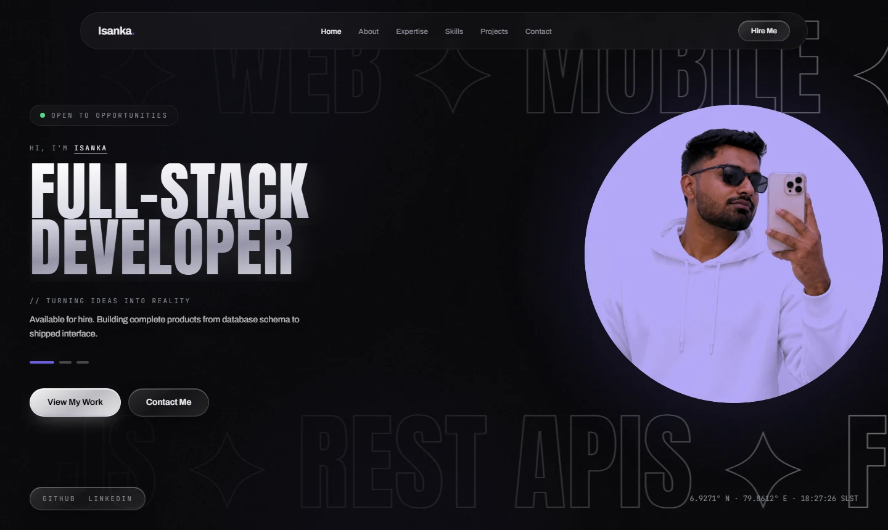

<div align="center">

# Isanka Samarawickrama — Portfolio

**Backend · Web · Flutter Mobile**

A dark, motion-driven personal portfolio built around a chrome-and-violet
design system, kinetic typography, and a scroll experience that stays smooth
on a mid-range phone.

[**View Live →**](https://isanka-samarawickrama.vercel.app/)

[](https://isanka-samarawickrama.vercel.app/)




</div>

---

## Highlights

**Boot sequence into the hero.** The loader draws the wordmark as hairline
outline type and fills it with chrome from the baseline up as real assets
load — the name *is* the progress bar. At 100% it scales up and blurs as the
camera pushes through it, and the hero plays its entrance behind the
transition rather than after it.

**Duotone portrait plate.** The photo is multiply-blended onto a violet disc,
so the studio backdrop dissolves into the disc colour and the subject reads as
a two-tone print. One image, no masking, no cut-out required.

**Kinetic outline typography.** Two seamless marquee rows of hairline-stroked
display type drift in opposite directions behind the composition.

**Rotating focus.** The headline cycles through three disciplines on a timer,
each line revealed with a masked slide-up, with clickable progress indicators.

**Motion that behaves.** GSAP drives the choreography, Lenis smooths the
scroll, and everything is gated behind `prefers-reduced-motion`.

---

## Stack

| Layer | Choice |
|---|---|
| Build | Vite 8 |
| UI | React 19 · TypeScript (strict) |
| Styling | Tailwind CSS v4 (CSS-first `@theme`) |
| Motion | GSAP · Lenis smooth scroll |
| Lint | oxlint |
| Hosting | Vercel |

Four runtime dependencies total — `react`, `react-dom`, `gsap`, `lenis`.
Production build is **~810 KB** total, **~130 KB gzipped** for JS.

---

## Running locally

```bash
npm install
npm run dev        # http://localhost:5173
```

```bash
npm run build      # tsc -b && vite build  ->  dist/
npm run preview    # serve the production build
npm run lint       # oxlint
```

---

## Content lives in data, not components

Every personal detail sits in `src/data/`. No copy is hardcoded in a component,
so the site can be re-skinned for someone else by editing seven files.

| File | Contents |
|---|---|
| `profile.ts` | Name, role, bio, email, socials, hero headline phases |
| `expertise.ts` | The four `// ROOT 0n` capability cards |
| `stack.ts` | Skills marquee chips (two rows, opposite directions) |
| `timeline.ts` | `// ENGINEERING ROADMAP` milestones |
| `projects.ts` | Project carousel cards |
| `certifications.ts` | Credential grid |
| `nav.ts` | Nav items and section ids |

---

## Structure

```
src/
├─ sections/     Hero, About, Philosophy, Expertise, Pipeline,
│                Skills, Timeline, Projects, Certifications,
│                Contact, Footer
├─ components/   BootLoader, Nav, CursorGlow, Reveal,
│                SectionLabel, Stat, LocalClock
├─ hooks/        useReducedMotion, useSpotlight, useCountUp
├─ data/         all site content
└─ index.css     design tokens + custom utilities
```

The design system is defined once in `src/index.css` — colour tokens, the
chrome-gradient text treatment, glass surfaces, the spotlight/lift card
behaviour, aurora and marquee animations — and consumed everywhere through
utility classes.

---

## Deployment

Pushed to `main` → Vercel builds and deploys automatically.

| Setting | Value |
|---|---|
| Framework | Vite |
| Build command | `npm run build` |
| Output directory | `dist` |

Link previews are served from `public/og.png` (1200×630). If the domain
changes, update the absolute `og:url` and `og:image` values in `index.html` —
crawlers ignore relative paths.

---

## Accessibility & performance notes

- All motion respects `prefers-reduced-motion`
- Hover-only affordances use `:focus-visible` so keyboard users get the same cues
- Portrait ships as WebP (117 KB at 1086×1448)
- No horizontal overflow down to 320 px
- Fonts preconnected and loaded with `display=swap`

---

<div align="center">

**[isanka-samarawickrama.vercel.app](https://isanka-samarawickrama.vercel.app/)**
&nbsp;·&nbsp;
[GitHub](https://github.com/isanka23)
&nbsp;·&nbsp;
[LinkedIn](https://www.linkedin.com/in/isanka-samarawickrama-153026268)

</div>
